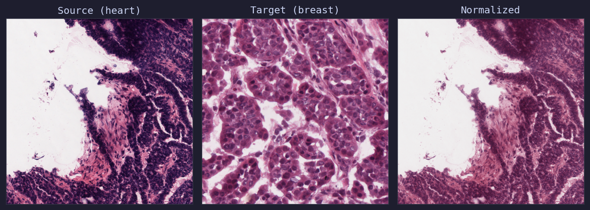

Stain Normalization
===================

Stain normalization reduces colour variation caused by differences in staining protocols,
scanners, and laboratory conditions across histopathology slides.

.. important::

   The built-in :class:`~glasscut.stain_normalizers.macenko.MacenkoStainNormalizer` and
   :class:`~glasscut.stain_normalizers.reinhardt.ReinhardtStainNormalizer` are **reference
   implementations** provided to demonstrate the :class:`~glasscut.stain_normalizers.base.StainNormalizer`
   interface. Both emit a ``UserWarning`` indicating their experimental status.

   For production use, we strongly recommend implementing your own normalizer adapted to
   your specific stain types, tissue morphology, and computational constraints.

   Macenko normalization: heart tissue (source) matched to breast tissue (target)

Macenko Normalizer
------------------

The Macenko method uses principal component analysis (PCA) on optical density values to
estimate stain vectors, then matches the stain distribution to a target image.

.. code:: python

   from glasscut import MacenkoStainNormalizer
   from PIL import Image

   normalizer = MacenkoStainNormalizer()

   target = Image.open("target.png")
   normalizer.fit(target)

   source = Image.open("source.png")
   normalized = normalizer.transform(source)
   normalized.save("normalized.png")

.. warning::

   The Macenko normalizer is marked as **experimental**. Results may vary across different
   tissue types and staining qualities.

Reinhardt Normalizer
--------------------

The Reinhardt method matches the mean and standard deviation of each LAB colour channel
on tissue regions, providing a fast approximate normalisation.

.. code:: python

   from glasscut import ReinhardtStainNormalizer
   from PIL import Image

   normalizer = ReinhardtStainNormalizer()

   target = Image.open("target.png")
   normalizer.fit(target)

   source = Image.open("source.png")
   normalized = normalizer.transform(source)
   normalized.save("normalized.png")

.. warning::

   The Reinhardt normalizer is marked as **experimental**. Results may vary across different
   tissue types and staining qualities.

Custom Normalizers (Recommended)
--------------------------------

Implement a custom normalizer by subclassing :class:`~glasscut.stain_normalizers.base.StainNormalizer`:

.. code:: python

   from glasscut.stain_normalizers import StainNormalizer
   from PIL import Image

   class MyNormalizer(StainNormalizer):
       def fit(self, target_image: Image.Image, **kwargs):
           pass

       def transform(self, image: Image.Image, **kwargs) -> Image.Image:
           pass

Using with GridTiler
--------------------

Stain normalizers can be used as tile transforms in the tiling pipeline:

.. code:: python

   normalizer = MacenkoStainNormalizer()
   normalizer.fit(target_image)

   tiler = GridTiler(
       tile_size=(512, 512),
       transforms=[normalizer.transform],
   )
