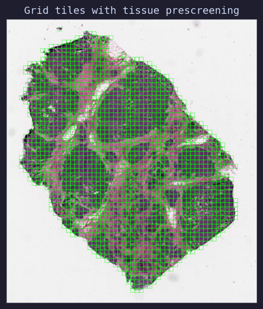

Tiling Strategies
=================

GlassCut provides a grid-based tiler out of the box, but the :class:`~glasscut.tiler.base.Tiler`
abstract base class is designed to be extended with custom strategies.

.. important::

   The built-in :class:`~glasscut.tiler.grid.GridTiler` is provided as a **reference implementation**
   to demonstrate the tiling API and common patterns. For production use, we strongly recommend
   implementing your own tiling strategy tailored to your specific slide dimensions, tissue types,
   and downstream task requirements.

GridTiler
---------

The :class:`~glasscut.tiler.grid.GridTiler` extracts tiles on a regular grid with configurable
overlap and tissue-prescreening.

.. code:: python

    from glasscut import Slide, GridTiler

    tiler = GridTiler(
        tile_size=(512, 512),
        magnification=20
    )

    slide = Slide("slide.svs")

    for tile in tiler.extract(slide):
        tile.save(f"tiles/{tile.coords}.png")

   Grid tiles overlaid on heart tissue slide; green tiles pass tissue prescreening

Key Parameters
--------------

.. list-table::
   :header-rows: 1

   * - Parameter
     - Default
     - Description
   * - ``tile_size``
     - ``(512, 512)``
     - Dimensions of each tile in pixels
   * - ``magnification``
     - ``20``
     - Target magnification level
   * - ``overlap``
     - ``0``
     - Pixel overlap between adjacent tiles
   * - ``min_tissue_ratio``
     - ``0.2``
     - Minimum tissue fraction to keep a tile (0–1)
   * - ``tissue_detector``
     - ``None``
     - A :class:`~glasscut.tissue_detectors.base.TissueDetector` instance
   * - ``transforms``
     - ``None``
     - List of :class:`~glasscut.tiler.base.TileTransform` callables

Performance
-----------

GridTiler uses batched parallel extraction via ``ThreadPoolExecutor``. You can control
parallelism with ``n_workers`` and ``batch_size`` parameters in the ``extract()`` method.

Visualisation
-------------

.. code:: python

    viz = tiler.visualize(slide)
    viz.save("grid_overview.png")

Custom Tilers
-------------

Implement a custom tiler by subclassing :class:`~glasscut.tiler.base.Tiler`:

.. code:: python

    from glasscut.tiler import Tiler
    from glasscut.slides import Slide
    from glasscut.tile import Tile

    class MyCustomTiler(Tiler):
        def get_tile_boxes(self, slide: Slide):
            return [(0, 0, 512, 512)]

        def extract(self, slide, *, n_workers=4, batch_size=128):
            for box in self.get_tile_boxes(slide):
                tile = slide.extract_tile(box[:2], box[2:], magnification=20)
                yield tile
